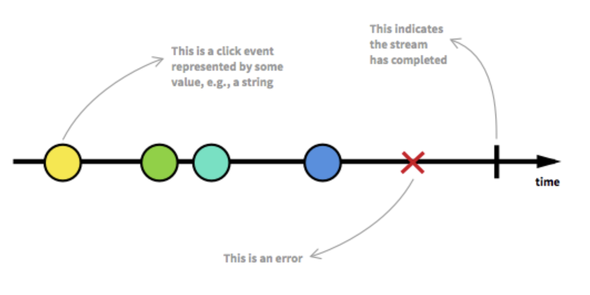

[This post on GitHub](https://gist.github.com/staltz/868e7e9bc2a7b8c1f754#reactive-programming-is-programming-with-asynchronous-data-streams) literally the greatest explanation of reactive programming I have found on Internet and I get to decide to summarize it here into several important points.

# Reactive Programming is programming with asynchronous data stream.



- A __stream__, or an __observable__, is a sequence of ongoing events ordered in time which can emit three things:
  - a value of some type
  - an error
  - a 'completed' signal.
- We capture these values only __asynchronously__.
  - Means we don't get to decide when to execute each function. We just define each that will execute when a value / an error / a completed signal is emitted.
- The "listening" to the stream is called __subscribing__.
  - By subscribing a stream, we can do something when a value is emitted.
- The functions we are defining are __observers__.
- The stream is the subject (or "__observable__") being observed.
- Reactive Programming raises the level of abstraction of your code so you can focus on the interdependence of events that define the business logic, rather than having to constantly fiddle with a large amount of implementation details. Code in RP will likely be more concise. __Apps nowadays have an abundance of real-time events of every kind that enable a highly interactive experience to the user. We need tools for properly dealing with that, and Reactive Programming is an answer.__

# Promise is an Observable.

This RxJS function called `fromPromise` will convert a Promise to an Observable.

```JavaScript
// Create a stream from promise.
let stream = Rx.Observable.fromPromise(promise);
```

A Promise is simply an Observable with one single emitted value. Rx streams go beyond promises by allowing many returned values.

# Asynchronous API call.


# Example

http://jsfiddle.net/staltz/8jFJH/48/

```JavaScript
var refreshButton = document.querySelector('.refresh');
var closeButton1 = document.querySelector('.close1');
var closeButton2 = document.querySelector('.close2');
var closeButton3 = document.querySelector('.close3');

var refreshClickStream = Rx.Observable.fromEvent(refreshButton, 'click');
var close1ClickStream = Rx.Observable.fromEvent(closeButton1, 'click');
var close2ClickStream = Rx.Observable.fromEvent(closeButton2, 'click');
var close3ClickStream = Rx.Observable.fromEvent(closeButton3, 'click');

var requestStream = refreshClickStream.startWith('startup click')
    .map(function() {
        var randomOffset = Math.floor(Math.random()*500);
        return 'https://api.github.com/users?since=' + randomOffset;
    });

var responseStream = requestStream
    .flatMap(function (requestUrl) {
        return Rx.Observable.fromPromise($.getJSON(requestUrl));
    });

function createSuggestionStream(closeClickStream) {
    return closeClickStream.startWith('startup click')
        .combineLatest(responseStream,             
            function(click, listUsers) {
                return listUsers[Math.floor(Math.random()*listUsers.length)];
            }
        )
        .merge(
            refreshClickStream.map(function(){ 
                return null;
            })
        )
        .startWith(null);
}

var suggestion1Stream = createSuggestionStream(close1ClickStream);
var suggestion2Stream = createSuggestionStream(close2ClickStream);
var suggestion3Stream = createSuggestionStream(close3ClickStream);


// Rendering ---------------------------------------------------
function renderSuggestion(suggestedUser, selector) {
    var suggestionEl = document.querySelector(selector);
    if (suggestedUser === null) {
        suggestionEl.style.visibility = 'hidden';
    } else {
        suggestionEl.style.visibility = 'visible';
        var usernameEl = suggestionEl.querySelector('.username');
        usernameEl.href = suggestedUser.html_url;
        usernameEl.textContent = suggestedUser.login;
        var imgEl = suggestionEl.querySelector('img');
        imgEl.src = "";
        imgEl.src = suggestedUser.avatar_url;
    }
}

// Subscription.
suggestion1Stream.subscribe(function (suggestedUser) {
    renderSuggestion(suggestedUser, '.suggestion1');
});

suggestion2Stream.subscribe(function (suggestedUser) {
    renderSuggestion(suggestedUser, '.suggestion2');
});

suggestion3Stream.subscribe(function (suggestedUser) {
    renderSuggestion(suggestedUser, '.suggestion3');
});
```

- Don't get confused with `startWith`. This is just a descriptive part to explain the beginning of the steam. Here in this example `requestStream` is mapped to a github link string value, which does not have anything to do with its input. so `startWith(x)` can have anything for its x.
- By calling `combineLatest` method, we combine two streams here - `closeClickStream` and `responseStream`. [Reference](https://github.com/Reactive-Extensions/RxJS/blob/master/doc/api/core/operators/combinelatest.md)

